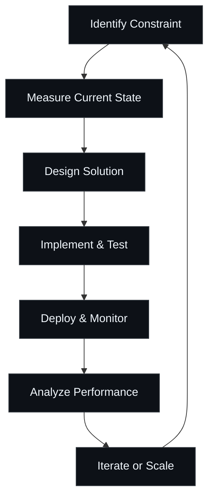
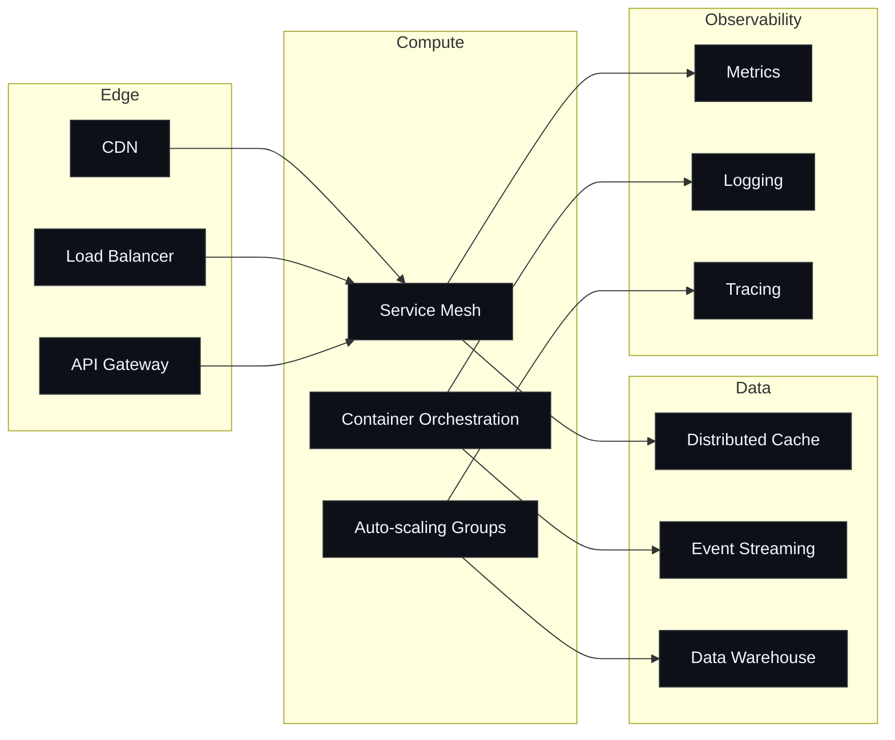

# Adhi Tanjung

Systems Architect

I build systems that don't break. I eliminate bottlenecks others create. I architect for scale before it's needed.

  

## Principles

- Measure everything. Optimize what matters.
- Design for failure. Build for resilience.
- Automate repetitive tasks. Focus on high-impact problems.
- Code is liability. Less is more.
- Performance is a feature. Reliability is non-negotiable.

## Engineering Philosophy

## System Design Patterns

## Current Focus

Distributed systems at scale. Real-time data processing. Infrastructure automation. Performance engineering. Team velocity optimization.

I solve problems that matter. I build systems that last. I eliminate technical debt before it compounds.

  
Performance Metrics

   
  

    
     
    
  

[LinkedIn](https://www.linkedin.com/in/adhitanjung/)
